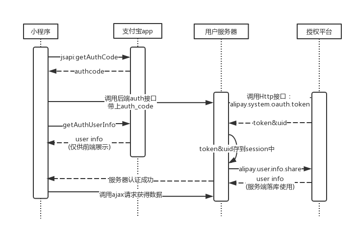

# Laravel支付宝小程序扩展包
>为什么要写一个laravel扩展包？
>最近支付宝小程序允许个人开发者开放申请，但是对于官方给的[PHP版SDK](https://docs.open.alipay.com/54/103419/)没有**composer**包管理，对于laravel开放者来说，这是一个很大问题，需要自己动手拆开嵌入到laravel项目中，因此产生做出一个扩展包的形式。

### 目前支持的接口功能
- [x] alipay.system.oauth.token(换取授权访问令牌)
- [x] alipay.user.info.share(支付宝会员授权信息查询接口)
- [ ] 小程序二维码生成

### 使用方法
**运行以下命令以获取最新版本：**

```
composer require icharle/alipaytool dev-master
```

**将服务提供者添加到配置文件中的`providers`数组中`config/app.php`，如下所示：**

```
'providers' => [

    ...

    Icharle\Alipaytool\AlipaytoolServiceProvider::class,
]
```

**发布配置文件**

```
php artisan vendor:publish --tag=alipaytool
```
此时会生成`config/alipaytool.php`、`storage/pem/public.txt`、`storage/pem/private.txt`文件。

**配置AppID、支付宝公钥及应用私钥**

在根目录`.env`文件中添加如下代码

```
# 填入小程序AppID
ALIPAY_APP_ID=xxxxx  
```

在`storage/pem/public.txt`、`storage/pem/private.txt`文件中分别填入支付宝公钥及应用私钥([如何生成支付宝公钥及应用私钥？](https://docs.alipay.com/mini/introduce/rsa2))

### 快速入门
>先了解下授权流程吧。[官网详细介绍](https://docs.alipay.com/mini/introduce/auth)(如果之前做个微信小程序开发的话，可以忽略啦，流程跟微信的差不多。)



>先是小程序端通过`my.getAuthCode`方法得到`authcode`，并将其传入后端，后端调用`alipay.system.oauth.token`接口得到`access_token`以及`支付宝用户的userId`。`access_token`再配合调用`alipay.user.info.share`方法即可解密得到用户详细信息。

#### 使用案例
```
## 小程序端调用(官方示例)
my.getAuthCode({
	scopes: 'auth_user', // 主动授权（弹框）：auth_user，静默授权（不弹框）：auth_base
	success: (res) => {
		if (res.authCode) {
		  // 认证成功
		  // 调用自己的服务端接口，让服务端进行后端的授权认证，并且种session，需要解决跨域问题
		  my.httpRequest({
		    url: 'http://xxx.com/auth', // 该url是自己的服务地址，实现的功能是服务端拿到authcode去开放平台进行token验证
		    data: {
		      authcode: res.authCode
		    },
		    success: () => {
		      // 授权成功并且服务器端登录成功
		    },
		    fail: () => {
		      // 根据自己的业务场景来进行错误处理
		    },
		  });
		}
	},
});

## 后端示例
/**
* 支付宝授权登录尝试
* code值反馈
*      40002  => authCode(授权码code)无效
*      40006  => ISV权限不足，建议在开发者中心检查对应功能是否已经添加
*      10000  => 请求成功
*/
public function auth(Request $request)
{
    $data = $request->all();
    $authtoken = $data['authCode'];
    $app = new Alipaytool();
    $alipay_system_oauth_token_response = $app::getAccessToken($authtoken);
    if (isset($alipay_system_oauth_token_response['code']) && $alipay_system_oauth_token_response['code'] == 40002) {
        exit('授权码code无效');
    }
    // echo $alipay_system_oauth_token_response['access_token'];
    /**
    * 执行成功后 $alipay_system_oauth_token_response => 可以得到如下
    * "access_token" => "访问令牌。通过该令牌调用需要授权类接口"
    * "alipay_user_id" => "暂时不懂是啥 官方也没有给出"
    * "expires_in" => 访问令牌的有效时间，单位是秒。
    * "re_expires_in" => 刷新令牌的有效时间，单位是秒。
    * "refresh_token" => "刷新令牌。通过该令牌可以刷新access_token"
    * "user_id" => "支付宝用户的唯一userId"
    */

    $alipay_user_info_share_response = $app::getUserInfoByAccessToken($alipay_system_oauth_token_response['access_token']);
    if (isset($alipay_user_info_share_response['code']) && $alipay_user_info_share_response['code'] == 40006) {
        exit('ISV权限不足，建议在开发者中心检查对应功能是否已经添加');
    }

    dd(alipay_user_info_share_response);

    /**
    * 执行成功后 $alipay_user_info_share_response => 可以得到如下(按照需要存入数据库中)
    * "code" => "10000"
    * "msg" => "Success"
    * "avatar" => "用户头像地址"
    * "city" => "市名称。"
    * "gender" => "只有is_certified为T的时候才有意义，否则不保证准确性.
    性别（F：女性；M：男性）。"
    * "is_certified" => "是否通过实名认证。T是通过 F是没有实名认证。"
    * "is_student_certified" => "是否是学生"
    * "nick_name" => "用户昵称"
    * "province" => "省份名称"
    * "user_id" => "支付宝用户的userId"
    * "user_status" => "用户状态（Q/T/B/W）。 Q代表快速注册用户 T代表已认证用户 B代表被冻结账户 W代表已注册，未激活的账户"
    * "user_type" => "用户类型（1/2） 1代表公司账户2代表个人账户"
    */

}
```